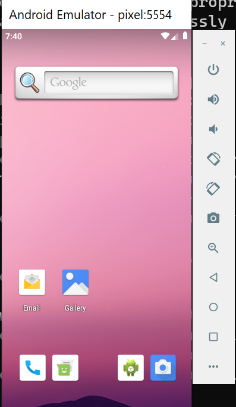
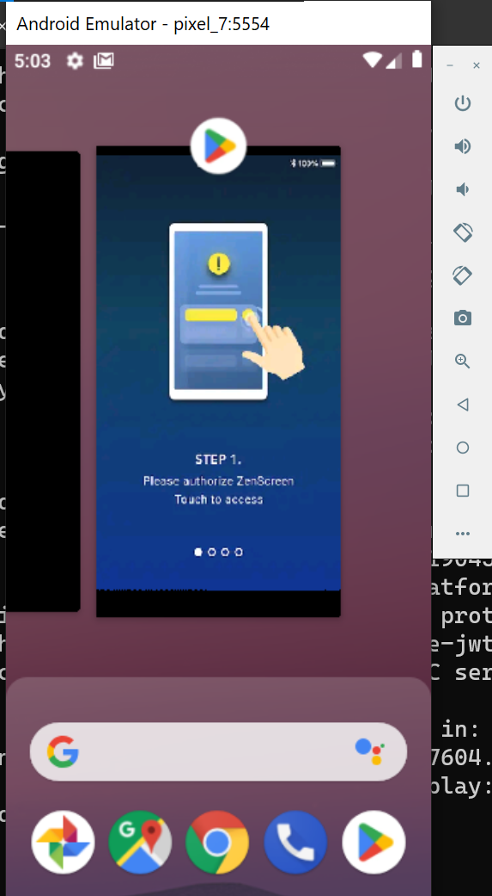

# Minimal Setup of Running Android Emulator on Windows

## Step 1

 Download the cmd-line tools from official google site

## Step 2

 Extract the zip content of the above downloaded file to let's say cmdline-tools

## Step 3

 Inside the cmdline-tools create a new folder as latest and move all the content (/bin, readme etc that is previously present in the extracted location ) to the latest directory

( Previously getting error when simply running avdmanager and sdkmanager commands for downloading , to know more check out this link :<https://stackoverflow.com/questions/65262340/cmdline-tools-could-not-determine-sdk-root>)

### After running Step 4 Commands final directory should like this : 

## Step 4

 Go to the latest folder bin directory ```H:\Android\software\cmdline-tools\latest\bin>``` and run the following commands

### a

 ```
 sdkmanager emulator
 ```

### b

```
sdkmanager "system-images;android-28;default;x86_64"
```

### c

```
sdkmanager "platform-tools"
```

### d

```
sdkmanager "build-tools;28.0.3"
```

### e

```
sdkmanager "platforms;android-28"
```

Extras for pixel 7:

```
sdkmanager "system-images;android-28;google_apis_playstore;x86_64"
```

### Some details /references about the above command

#### a. Android-28 corresponds to **Android 9**, also known as **Pie**

#### b. Above command is taken from below reference: <https://ksrk.medium.com/install-flutter-without-android-studio-on-window-9d3781172912>

## Step 5

 Create AVD by navigating into ```H:\Android\software\cmdline-tools\latest\bin>```

 and running below commands:

```
avdmanager -s create avd -n Pixel -k "system-images;android-28;default;x86_64"
```

Extra: For Pixel 7:

```
avdmanager create avd -n pixel_7 -k "system-images;android-28;google_apis_playstore;x86_64"
```

## Step 6

 See all the avds present by going to the Emulator directory i.e ```H:\Android\software\emulator>```
and run below command:

```
emulator -list-avds
```

## Step 7

 To run the avd type the name like in the above case I have declared pixle to be avd name checkout Step 6 command: avdmanager -s create avd -n <b> &lt; name of the avd &gt;  </b> -k "
Go to the emulator directory i.e ```H:\Android\software\emulator>```

```
emulator -avd pixel
```





EXTRA: I am trying to get the apk file from the emulator so below steps are for that :

## Step 8

For downloading the package that we intially download from the playstore :
a. Get all the installed packages through adb:
Navigate to adb location:```H:\Android\software\platform-tools>```

```
adb shell pm list packages
```

b. Get the location of the installed software
adb pull <b> &lt; apk_path &gt; H:\path\to\destination </b>

```
adb pull /data/app/com.abc.def-2u4DtaEcf5HIK5egY2ebUw==/base.apk H:\Android\software\platform-tools\apks
```

EXTRA : In the below steps I am trying to edit and create a new apk file from existing .apk file only without any source code

## Step 9

Install apk tool : Steps mentioned in : <https://apktool.org/docs/install>

## Step 10

Use the command in the directory where .apk file is present:

```
apktool d filename.apk
```

to decompile the apk file. This will create a folder with the same name as the apk file that contains the source code and resources of the app.

## Step 11

Use the command:

```
apktool b foldername
```

to recompile the apk file. This will create a new apk file in the folder named dist inside the folder you decompiled.

## Step 12

Sign the apk file with below certificate.You can use the keytool command that comes with the JDK:

```
keytool -genkey -v -keystore my-release-key.keystore -alias alias_name -keyalg RSA -keysize 2048 -validity 20000
```

## Step 13

Sign your APK with your keystore using the jarsigner command that also comes with the JDK:

```
jarsigner -verbose -sigalg SHA1withRSA -digestalg SHA1 -keystore my-release-key.keystore /path/to/your/app.apk alias_name
```

## Step 14

You can run the final apk through the remote debugging wifi in Developer options in Android.
Turn the Debugging through Wifi Feature on, and run the below command where the adb is installed.
Click on the Pair Device with Pairing Code.
( IP and Pair Code will be displayed on the Popup)

Meanwhile in your local computer Navigate to adb location:```H:\Android\software\platform-tools>```

and run the below command:

```
adb pair <Enter the IP Showing in the option>
```

It will ask you for Pair Code that was seen from your mobile
enter it and you are connected.

You can see the devices listed as :

```
adb devices
```

and for installing the apk on that device use:

```
adb install /path/to/apk.apk
```

If you are facing any Certificate issues always use below command to uninstall and then install again :

```
adb uninstall com.abc.def 
```

here com.abc.def is  Package name.
