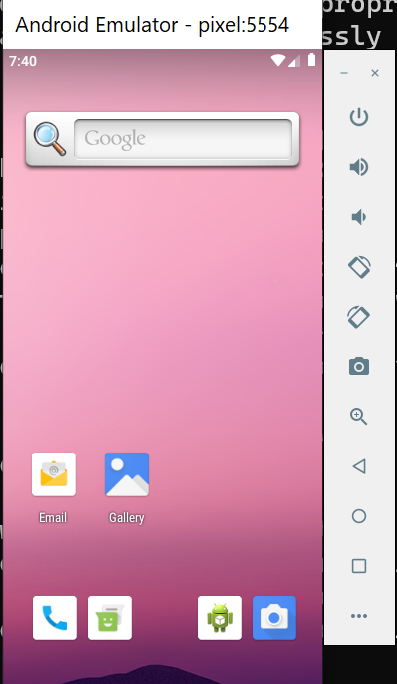

# Minimal Setup of Running Android Emulator on Windows

## Step 1

 Download the cmd-line tools from official google site

## Step 2

 Extract the zip content of the above downloaded file to let's say cmdline-tools

## Step 3

 Inside the cmdline-tools create a new folder as latest and move all the content (/bin, readme etc that is previously present in the extracted location ) to the latest directory

( Previously getting error when simply running avdmanager and sdkmanager commands for downloading , to know more check out this link :<https://stackoverflow.com/questions/65262340/cmdline-tools-could-not-determine-sdk-root>)

### After running Step 4 Commands final directory should like this : 

## Step 4

 Go to the latest > bin directory and run the following commands

```
    H:\Android\software\cmdline-tools\latest\bin>sdkmanager emulator
    H:\Android\software\cmdline-tools\latest\bin>sdkmanager 'system-images;android-28;default;x86_64'
    H:\Android\software\cmdline-tools\latest\bin>sdkmanager 'platform-tools'
    H:\Android\software\cmdline-tools\latest\bin>sdkmanager 'build-tools;28.0.3'
    H:\Android\software\cmdline-tools\latest\bin>sdkmanager 'platforms;android-28'
```

### Some details /references about the above command

#### a. Android-28 corresponds to **Android 9**, also known as **Pie**

#### b. Above command is taken from below reference: <https://ksrk.medium.com/install-flutter-without-android-studio-on-window-9d3781172912>

## Step 5

 Create AVD

```
    avdmanager -s create avd -n Pixel -k 'system-images;android-28;default;x86_64'
```

## Step 6

 See all the avds present by going to the Emulator directory

```
    H:\Android\software\emulator>emulator -list-avds
Pixel
```

## Step 7

 To run the avd type the name like in the above case I have declared pixle to be avd name checkout Step 6 command: avdmanager -s create avd -n <b> &lt; name of the avd &gt;  </b> -k "

```
    H:\Android\software\emulator>emulator -avd pixel
```


